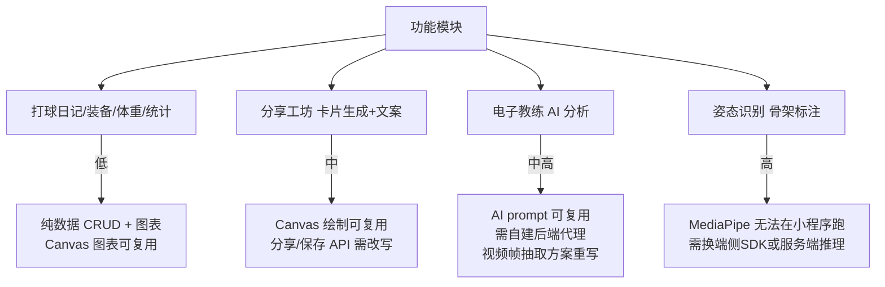

> **本页信息**
>
> | 项目 | 内容 |
> |------|------|
> | 文档编号 | 01 |
> | 文档版本 | v1.2.0 |
> | 文档状态 | 📋 待执行 |
> | 最后更新 | 2026-08-05 |
> | 对应功能/内容 | Tennis Diary Web 应用迁移微信小程序可行性分析与方案 |
>
> **变更历史**
>
> | 日期 | 版本 | 说明 |
> |------|:----:|------|
> | 2026-08-05 | v1.2.0 | 前端技术栈调整：微信原生小程序 → uni-app + Vite + Vue3 + Pinia + Vant4 + Tailwind CSS；H5 端预留用于后端测试；更新迁移评估与工时 |
> | 2026-08-04 | v1.1.0 | 架构调整：微信云开发方案 → 自建 FastAPI + SQLite；新增后台接口清单、部署方案、微信登录链路 |
> | 2026-08-04 | v1.0.0 | 初版 |
>
> **关联文档**：Tennis Diary 参考源码（`docs/reference/tennis-diary/`）

# Tennis Diary（网球日记）迁移微信小程序可行性分析报告

> 分析日期：2026-08-04
> 分析对象：`/workspace/docs/reference/tennis-diary`

---

## 一、项目概述

Tennis Diary 是一个用 **vibe coding** 方式构建的**纯前端 PWA 应用**，面向网球爱好者，核心功能是：结构化记录打球数据、本地姿态识别（MediaPipe）做动作分析、AI 六维评分、生成社媒分享素材。

**原技术栈**：React 18 + TypeScript + Vite + Tailwind CSS + Dexie(IndexedDB) + MediaPipe Tasks Vision + vite-plugin-pwa

**原设计哲学**：「数据 100% 存本机、隐私优先、无需登录」。

**目标技术栈（小程序版）**：

| 端 | 技术栈 |
|---|---|
| 小程序前端 | **uni-app**（Vue 3 + Vite + TypeScript）+ **Pinia**（状态管理）+ **Vant 4**（移动端组件库）+ **Tailwind CSS**（`tailwindcss-miniprogram-preset`） |
| H5 前端（测试用） | 同 uni-app 编译到 H5，**仅用于后端 API 联调测试**，不作为线上发布端 |
| 后端 | 自建 **FastAPI**（Python）+ **SQLite** 数据库 |
| 部署 | 本地运行 / Docker / HF Space + Nginx 反代 |

代码结构清晰，约 27 个源码文件，整体是一个典型的「移动端单页 + 底部 Tab」布局，移动优先（`max-w-md mx-auto`）。

---

## 二、优势分析

### 2.1 产品定位精准，差异化清晰

- 「隐私优先 + 本机存储 + 无需登录」是明显区别于大多数 SaaS 化运动 App 的卖点。
- 把 AI 能力做成**可选增强**而非必需依赖——无 Key 也能用全部本地功能（`buildLocalReport`），降低了使用门槛。

### 2.2 架构耦合度低，业务逻辑独立

核心业务逻辑被很好地封装为**纯函数模块**，不依赖 React 渲染，这是迁移最大的技术红利：

| 模块 | 文件 | 说明 | 可复用度 |
|---|---|---|---|
| 数据模型 | `types.ts` | Diary / Gear / WeightRecord / Analysis / Post 等完整类型定义 | ✅ 100% |
| AI 调用 | `ai.ts` | OpenAI 兼容接口封装 + NTRP 校准 Prompt | ✅ 90%（接口层改写） |
| 姿态测量 | `pose.ts` | MediaPipe 封装 + 骨架绘制 + 关节角度计算 | ⚠️ 60%（算法复用，运行环境重写） |
| 工具函数 | `utils.ts` | 纯计算工具函数 | ✅ 85% |
| 图片生成 | `report-image.ts` | Canvas 绘制逻辑 | ✅ 80% |
| 分享卡片 | `Share.tsx` | Canvas 长图绘制 | ✅ 75% |
| 数据存储 | `db.ts` | Dexie(IndexedDB) 封装 | ❌ 不可用，需重写 |

### 2.3 工程细节成熟

- 对 **iOS 视频黑屏/seek 失败**做了大量兜底（`ensurePainted` / `videoFrameIsBlack` / `seekVideo` 带 3s 超时），说明经过真机打磨。
- 金额隐私开关做了跨页面同步（`useMoneyVisibility` + 事件机制）。
- Canvas 生成长图、雷达图、热力图等可视化做得完整。
- PWA 已配置 manifest + service worker，有「添加到主屏幕」的基础。

### 2.4 设计语言统一

Tailwind 自定义了一套橄榄绿/青柠色的视觉体系（`olive`/`lime`/`paper`），组件库（`UI.tsx`）封装了 TopBar / Section / Seg / Sheet / Toast / Confirm 等，一致性强，迁移时视觉风格可直接沿用。

---

## 三、劣势分析

### 3.1 重度依赖 Web 专有 API，迁移成本高

项目核心功能大量使用浏览器独有能力，这是迁移到小程序的最大障碍：

| 能力 | Web 实现 | 小程序对应方案 | 迁移难度 |
|---|---|---|---|
| 本地存储 | IndexedDB (Dexie) | `wx.setStorageSync` / 云开发 DB / 本地文件 | 🟡 中 |
| 姿态识别 | MediaPipe WASM + WebGL (GPU delegate) | **小程序无 WebGL/WASM 能力**，需换方案 | 🔴 极高 |
| 视频逐帧分析 | `<video>` + `seekVideo` + Canvas 截图 | `wx.chooseMedia` + Canvas 逐帧实现极难 | 🔴 高 |
| 系统分享 | `navigator.share` | `wx.showShareImageMenu` / `wx.saveImageToPhotosAlbum` | 🟡 中 |
| 复制到剪贴板 | `navigator.clipboard` | `wx.setClipboardData` | 🟢 低 |
| 摄像头实时流 | `getUserMedia` / `<video>` | `camera` 组件或 `wx.createCameraContext` | 🟠 中高 |
| CSS 框架 | Tailwind（需构建） | uni-app 可通过 `tailwindcss-miniprogram-preset` 支持，基本沿用 | 🟢 低 |
| DOM 操作 | `document.createElement` / `querySelector` | 小程序端仍无 DOM（uni-app 在微信端编译为原生渲染），H5 端可正常使用 | 🟠 中高 |
| 路由 | `react-router-dom` (SPA) | 小程序原生页面栈 | 🟡 中 |

### 3.2 数据「本机孤岛」与小程序天然矛盾

- Web 版把 `Blob`（RallyClip 视频）、`dataURL`（封面/高光帧）直接塞进 IndexedDB。
- 小程序中视频 Blob 存储受限，dataURL 存 storage 易超限（单 key 1MB、总量 10MB）。
- **隐私优先、本机存储**的卖点，在小程序里会变成「数据难迁移、易丢失（清缓存即没）」的弱点。
- **解决方案**：将数据层从「本机 IndexedDB」转为「自建 FastAPI + SQLite 云端数据库」，配合微信登录（`wx.login` → JWT）实现用户数据归属与多设备同步，从「本机孤岛」转型为「账号体系 + 云端安全存储」。

### 3.3 AI 配置模式不适合小程序分发

Web 版让用户自己填 API Key（`localStorage`）。小程序上架审核**不允许引导用户填第三方 API Key**（尤其阿里/OpenAI），否则审核大概率被拒。必须改为：自有后端代理或云开发云函数转发。

**解决方案**：FastAPI 后端作为 AI 网关，`/api/ai/analyze` 端点内部持有 API Key，小程序只携带 JWT 鉴权即可调用。Key 完全不存在于客户端，自然消解审核风险。

### 3.4 可维护性隐忧

- 大量 UI 逻辑与 `document` / DOM 直接交互（`toast` 用 `document.createElement`、`utils` 里直接操作 `document`）。小程序端无 DOM（uni-app 编译到微信端为原生渲染），这些逻辑仍需改写为 Vue 数据驱动；H5 端可直接沿用 DOM 操作，便于后端测试。
- 路由用 `react-router-dom`，状态用 React Hooks。**uni-app + Vue3 仍保持 SPA 组件心智**，相比原生小程序的双线程模型，迁移思维差异已大幅缩小。`react-router-dom` → uni-app `pages.json` + `uni.navigateTo` 需改写，React Hooks → **Pinia** 语义可对应。
- **React → Vue3 仍需全面改写**（约 27 个 `.tsx` 文件转为 `.vue` SFC），但逻辑结构可比原生小程序多复用约 30%。

---

## 四、迁移可行性评估

### 4.1 总体结论

**可行，但「重写式迁移」优于「翻译式迁移」。**

代码量不大（约 2000-2500 行），但**几乎所有文件都需要改写**，因为运行环境从「浏览器」切换到「小程序逻辑层 + 渲染层」。真正能复用的只有**业务逻辑层**（`types.ts`、`ai.ts` 的 prompt、`pose.ts` 的角度计算、`utils.ts` 的纯计算部分），占比约 **30%**。

### 4.2 四大功能模块迁移难度分级



| 模块 | 难度 | 关键改造点 |
|---|---|---|
| 日记/装备/体重/打卡统计 | 🟢 低 | 数据层换 `wx.setStorage`/云开发；图表 SVG→Canvas 或组件库；UI 用原生/WXML |
| 分享工坊（卡片+文案） | 🟡 中 | Canvas 绘制逻辑可复用 80%；`navigator.share`→`wx.saveImageToPhotosAlbum`；文案复制→`wx.setClipboardData` |
| 电子教练 AI 分析 | 🟠 中高 | `chatVision` 需改为云函数代理；**视频帧抽取**从 `<video>` 改为「上传视频→服务端抽帧」或「端上录制分段」 |
| 姿态识别/骨架标注 | 🔴 高 | **MediaPipe WASM 在小程序不可行**；可选：(a) 上传视频到服务端跑 MediaPipe；(b) 放弃本地骨架，纯 AI 视觉分析；(c) 等微信端侧 AI 能力 |

### 4.3 各文件迁移评估详表

| 源文件 | 迁移策略 | 预计改造量 | 备注 |
|---|---|---|---|
| `types.ts` | 直接复用 | 0% | 纯 TypeScript 类型定义 |
| `utils.ts` | 部分复用 | 20% | 去除 DOM 操作，保留纯计算；H5 端可直接复用 DOM 部分用于后端测试 |
| `ai.ts` | 重构 | 40% | Prompt 复用，HTTP 层改 `uni.request` 调 FastAPI |
| `pose.ts` | 重写 | 90% | 角度计算算法可复用，运行环境完全重写 |
| `db.ts` | 重写 | 100% | IndexedDB→FastAPI HTTP 接口 |
| `money.ts` | 改造 | 30% | React Context→Pinia store，逻辑语义可对应 |
| `report-image.ts` | 部分复用 | 30% | Canvas API 兼容，布局逻辑复用 |
| `App.tsx` | 重写 | 80% | SPA 路由→uni-app `pages.json` + TabBar 配置 |
| `pages/*.tsx` | 重写 | 50-60% | React TSX→Vue SFC，逻辑结构可比原生小程序多复用约 30%；Vant 4 组件覆盖大量 UI |
| `components/UI.tsx` | 改造 | 40% | React 组件→Vue 组件，**Vant 4 可替代 70%+ 的自定义组件**（Sheet/Toast/Confirm/Seg 等有现成对应） |
| `components/Charts.tsx` | 部分复用 | 50% | SVG→Canvas，计算逻辑复用 |
| `components/Icons.tsx` | 改造 | 40% | SVG 组件→Vue 组件或 iconfont |

---

## 五、推荐迁移路径

### 5.1 降本方案（首版推荐）

#### 数据层
放弃 IndexedDB，改用**自建 FastAPI + SQLite**。通过微信登录（`wx.login` → `code2Session` → openid → JWT）实现用户体系，数据存于自建数据库，支持多设备同步。产品定位从「纯本机隐私」转为「账号体系 + 云端安全存储」。

#### 姿态识别降级
首版**去掉本地骨架标注**，改为：
> 小程序上传视频 → FastAPI `/api/video/upload` 接收 → ffmpeg 抽帧 → `/api/pose/analyze` 服务端 MediaPipe Python 推理 → 返回关键点 → 小程序 Canvas 画骨架

把 Web 版两段式（本地骨架提取 + AI 分析）合并为服务端一段式。`pose.ts` 的 `drawSkeleton` 和角度计算算法**完整复用**，仅在运行环境上从 WebGL 迁移到服务端 Python MediaPipe。

#### AI 网关
用 FastAPI 的 `/api/ai/analyze` 端点做 OpenAI 兼容代理，API Key 存服务端环境变量，前端不暴露 Key，绕过审核风险。`analyzeSwing` 的 prompt 设计（含 NTRP 校准标尺）**完整复用**——这是最有价值的资产。

#### 微信登录
新增 **`wx.login` → FastAPI `/api/auth/login`** 鉴权链路：
1. 小程序调用 `wx.login()` 获取临时 `code`
2. 发送 `code` 到 FastAPI，后端用 `appid + secret` 调用 `code2Session` 换取 `openid`
3. 后端签发 JWT 返回小程序，后续请求携带 `Authorization: Bearer <jwt>`
4. 用户首次登录自动创建账号，无需额外注册流程

#### UI 迁移
- **Tailwind CSS**：通过 `tailwindcss-miniprogram-preset` 在 uni-app 中直接使用，原 Web 版的橄榄绿/青柠/米白主题色（`tailwind.config.ts` 自定义色值）**完整沿用**，无需手工转 WXSS。
- **Vant 4 组件库**：替代原 `UI.tsx` 中的自定义组件。映射关系如下：

  | Web 版 `UI.tsx` | Vant 4 组件 | 说明 |
  |---|---|---|
  | `TopBar` | `van-nav-bar` 或 uni-app 原生导航栏 | 顶栏 + 返回按钮 |
  | `Section` | `van-cell-group` + `van-cell` | 列表分组 |
  | `Seg`（分段选择器） | `van-tabs` / `van-dropdown-menu` | 分段/标签切换 |
  | `Sheet`（底部弹层） | `van-action-sheet` / `van-popup` | 底部弹出面板 |
  | `Toast` | `van-toast` | 轻提示 |
  | `Confirm`（确认框） | `van-dialog` | 模态确认弹窗 |

- **Vant 4 小程序兼容性**：Vant 4 主要为 H5 设计，在 uni-app 编译到小程序端时，部分依赖 `window`/`document` 的组件需通过 **uni-app 条件编译** 隔离：
  ```vue
  <!-- #ifdef H5 -->
  <van-some-component />  <!-- H5 端直接使用 -->
  <!-- #endif -->
  <!-- #ifdef MP-WEIXIN -->
  <view>小程序端降级实现</view>  <!-- 小程序端兜底 -->
  <!-- #endif -->
  ```
  绝大多数常用组件（Button/Cell/Toast/Dialog/Popup/Tabs 等）在小程序端可正常工作，仅少数依赖 Web API 的组件（如 `van-image-preview`）需要条件隔离。
- **底部 Tab**：uni-app `pages.json` 的 `tabBar` 配置，支持图标、选中色等。
- **视觉风格**：橄榄绿/青柠/米白体系通过 Tailwind 配置直接沿用，Vant 主题变量可通过 CSS 覆盖对齐。

### 5.2 技术架构对比

```
Web 版架构:
┌─────────────────────────────────────────┐
│  浏览器                                   │
│  ┌─────────┐  ┌──────────┐  ┌─────────┐ │
│  │ React   │  │ MediaPipe │  │ IndexedDB│ │
│  │ SPA     │  │ WASM     │  │ (Dexie)  │ │
│  └─────────┘  └──────────┘  └─────────┘ │
│  AI: 直连 OpenAI/阿里百炼 API             │
└─────────────────────────────────────────┘

小程序版推荐架构:
┌──────────────────────────────────────────────────────────┐
│  uni-app (Vue 3 + Vite + TypeScript)                     │
│  ┌──────────┐  ┌──────────┐  ┌───────────────────────┐  │
│  │ Vue SFC  │  │ Vant 4   │  │ uni.request (HTTPS)   │  │
│  │ +Tailwind│  │ + 自定义  │  │ Authorization: JWT    │  │
│  │ +Pinia   │  │ 组件      │  │                       │  │
│  └──────────┘  └──────────┘  └───────────┬───────────┘  │
│         │                                │               │
│         │    条件编译: #ifdef MP-WEIXIN  │               │
│         │       wx.login → code          │               │
│         │       wx.chooseMedia (视频)     │               │
│         │    条件编译: #ifdef H5          │               │
│         │       浏览器 API (测试用)       │               │
│         ▼                                ▼               │
│  ┌──────────────────────────────────────────────────────┐ │
│  │         自建 FastAPI 服务 (Docker / HF Space)         │ │
│  │                                                       │ │
│  │  /api/auth/login     微信登录 code2Session → JWT      │ │
│  │  /api/data/*         日记/装备/体重 CRUD              │ │
│  │  /api/ai/analyze     OpenAI 兼容代理 (Key 存服务端)   │ │
│  │  /api/video/upload   视频接收 + ffmpeg 抽帧           │ │
│  │  /api/pose/analyze   MediaPipe Python 姿态推理        │ │
│  │                                                       │ │
│  │  ┌────────────────┐  ┌──────────────────────────┐    │ │
│  │  │ SQLite         │  │ 文件存储 (本地卷/对象存储) │    │ │
│  │  │ 结构化数据      │  │ 视频 / 图片               │    │ │
│  │  └────────────────┘  └──────────────────────────┘    │ │
│  └──────────────────────────────────────────────────────┘ │
│         ▲                                                 │
│         │ HTTPS (自有备案域名 反代 HF Space / Docker)      │
└──────────────────────────────────────────────────────────┘
```

### 5.3 实施步骤建议

实施计划分 **小程序端** 与 **后台 FastAPI 端** 两条线并行推进：

| 阶段 | 端 | 内容 | 预计工时 |
|---|---|---|---|
| **Phase B1** | 后台 | FastAPI 脚手架、SQLite DB 模型（对应 `types.ts`）、`/api/auth/login` 微信登录/JWT 签发、`/api/data/*` CRUD 接口、文件存储封装 | 5-7 天 |
| **Phase 1** | 小程序 | uni-app 项目初始化、目录结构、`pages.json` TabBar、Tailwind + Vant 4 集成配置、`types.ts` 迁移、Pinia store 搭建、对接 B1 登录流程 | 3-4 天 |
| **Phase 2** | 小程序 | 数据层（调 B1 data 接口）、日记/装备/体重/打卡页面 Vue SFC 改写 + Charts 迁移（Vant 4 组件加速 UI 搭建） | 5-7 天 |
| **Phase B2** | 后台 | `/api/ai/analyze` AI 代理、`/api/video/upload` + ffmpeg 抽帧、`/api/pose/analyze` MediaPipe Python 推理、Dockerfile + HF Space 部署配置 | 7-10 天 |
| **Phase 4** | 小程序 | 电子教练：视频选择/上传、等待分析、报告展示（调 B2 接口） | 4-6 天 |
| **Phase 5** | 小程序 | 分享工坊：Canvas 卡片绘制迁移、保存图片、文案复制 | 2-4 天 |
| **Phase 6** | 双端 | 视觉调优、Vant 主题定制对齐橄榄绿、条件编译测试（H5 + 小程序双端验证）、真机测试、域名备案/反代配置、审核准备 | 5-7 天 |

**总计**：约 **4-7 周 / 1-2 人**（相比原生小程序方案，前端工时因 Tailwind + Vant 4 复用和 Vue SFC 结构可复用性而压缩约 1-2 周）

### 5.4 FastAPI 后台接口清单

| 端点 | 方法 | 说明 | Phase |
|---|---|---|---|
| `/api/auth/login` | POST | 接收 `wx.login` code，换 openid，签发 JWT | B1 |
| `/api/diaries` | GET/POST | 日记列表 / 创建 | B1 |
| `/api/diaries/{id}` | GET/PUT/DELETE | 日记详情 / 编辑 / 删除 | B1 |
| `/api/gears` | GET/POST | 装备列表 / 添加 | B1 |
| `/api/gears/{id}` | GET/PUT/DELETE | 装备详情 / 编辑 / 删除 | B1 |
| `/api/weights` | GET/POST | 体重记录列表 / 添加 | B1 |
| `/api/weights/{id}` | DELETE | 删除体重记录 | B1 |
| `/api/checkin` | GET/POST | 打卡记录查询 / 签到 | B1 |
| `/api/stats` | GET | 统计数据汇总 | B1 |
| `/api/ai/analyze` | POST | AI 六维评分（OpenAI 代理，含 NTRP 标尺 prompt） | B2 |
| `/api/video/upload` | POST | 视频上传 + ffmpeg 抽帧 | B2 |
| `/api/pose/analyze` | POST | MediaPipe 姿态推理，返回关键点坐标 | B2 |
| `/api/files/{filename}` | GET | 文件下载（图片/视频/缩略图） | B1 |

### 5.5 FastAPI 后台部署方案

| 部署方式 | 说明 | 适用场景 |
|---|---|---|
| 本地运行 | `uvicorn app:app --host 0.0.0.0 --port 8000` | 开发调试 |
| Docker 自部署 | `Dockerfile` + `docker-compose.yml`，SQLite 卷挂载 | 生产环境（自有服务器） |
| HF Space + 反代 | 利用 HF Space 免费 GPU/CPU 资源部署，自有备案域名 Nginx 反代 | 低成本公网服务 |

> **注意**：微信小程序 `wx.request` 要求合法域名**必须已备案**。HF Space 默认域名（`*.hf.space`）无法备案，生产环境需自备已备案域名 + Nginx/Caddy 反代到 HF Space 或 Docker 实例。

---

## 六、风险与建议

### 6.1 主要风险

| 风险项 | 影响等级 | 说明 |
|---|---|---|
| 视频逐帧分析 | 🔴 高 | 小程序**无法实现浏览器级逐帧 seek 体验**，需彻底改变交互（上传→等待→出报告） |
| HF Space 域名备案 | 🔴 高 | 微信 `request` 合法域名必须备案，HF Space 默认域名无法备案，**必须**自备域名 + 反代 |
| 微信登录态管理 | 🟠 中 | `wx.login` → JWT 鉴权链是新增模块，需处理好 token 刷新、过期、静默登录等边界 |
| FastAPI 运维 | 🟠 中 | 自建后端意味着需要关注服务可用性、日志、监控，相比云函数增加运维成本 |
| 审核风险 | 🟠 中 | 运动+AI+UGC 内容，需注意内容安全审核（AI 生成内容合规） |
| 隐私定位转变 | 🟡 低 | 从「本机存储」变为「账号+云端」，需在产品和文案上重新包装，但用户接受度通常较高 |
| 用户迁移 | 🟡 低 | Web 版和小程序版数据不互通，需考虑用户过渡方案 |

### 6.2 建议

1. **优先复用业务资产**：数据结构（`types.ts`）和 AI prompt（`ai.ts`）是迁移中价值最高、应优先抽取的部分。

2. **砍掉端侧姿态识别**：首版主打「上传视频 → FastAPI 服务端推理 → 出报告」+「数据记录 + 分享」两条线，暂不追求浏览器版同等的「本机实时骨架标注」体验。

3. **自建后端一体化**：利用 FastAPI 统一承载数据 CRUD、AI 代理、视频处理、姿态推理，相比云开发方案更灵活可控，且 SQLite 零运维成本起步。

4. **域名备案前置**：微信小程序开发阶段可用「不校验合法域名」模式调试，但提审前必须完成域名备案 + 反代配置，建议 Phase B1 阶段就启动备案流程（备案周期通常 2-4 周）。

5. **渐进式增强**：后续版本可考虑：
   - 端侧轻量姿态识别（等待微信官方端侧 AI 能力开放）
   - 多平台数据互通（Web 版 + 小程序版共享 FastAPI 后端）
   - 社交功能（好友对战、排行榜等原项目未覆盖的能力）
   - Postgres 升级（当 SQLite 遇到并发瓶颈时平滑迁移）

---

## 七、总结

Tennis Diary 是一个产品定位清晰、代码架构良好的网球数据管理应用。迁移到微信小程序在技术上是**完全可行**的，但需要**重写式迁移**而非简单翻译。

**核心策略**：
- ✅ 复用：数据模型（`types.ts`）、AI prompt（`ai.ts`）、角度计算算法（`pose.ts`）、Canvas 绘制逻辑（`report-image.ts`）、**Tailwind 样式体系**（橄榄绿/青柠/米白主题色）
- 🔄 重构：数据存储（SQLite 替代 IndexedDB）、AI 网关（FastAPI 代理）、状态管理（Pinia 替代 React Context）、路由（uni-app `pages.json` 替代 `react-router-dom`）、用户体系（微信登录 + JWT）、UI 组件（Vant 4 替代 `UI.tsx` 自定义组件）
- ❌ 放弃/替换：MediaPipe 端侧推理（→ FastAPI 服务端推理）、视频逐帧 seek（→ 上传 + ffmpeg 抽帧）、DOM 直接操作（→ Vue 数据驱动 / 条件编译 H5 保留）

**技术栈**：
- 前端：uni-app（Vue 3 + Vite + TypeScript）+ Pinia + Vant 4 + Tailwind CSS（`tailwindcss-miniprogram-preset`），编译目标为微信小程序；H5 端保留用于后端 API 联调测试
- 后端：FastAPI（Python）+ SQLite + ffmpeg + MediaPipe Python
- 部署：Docker / HF Space + Nginx 反代
- 鉴权：`wx.login` → `code2Session` → JWT

按推荐路径实施，预计 **4-7 周**可完成一个功能完整、体验优良的微信小程序版本（含自建 FastAPI 后台）。
