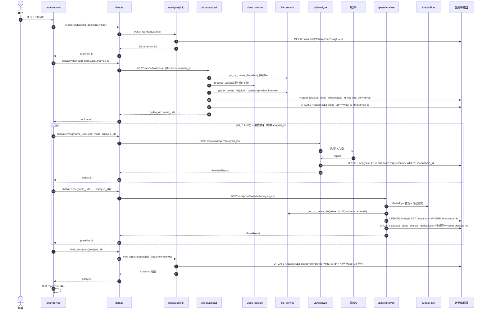

> **本页信息**
>
> | 项目 | 内容 |
> |------|------|
> | 文档编号 | 118 |
> | 文档版本 | v1.0.0 |
> | 文档状态 | 📋 待执行 |
> | 最后更新 | 2026-08-28 |
> | 对应功能/内容 | 电子教练「开始分析」流水线重构：点击即建 analysis_id，上传/AI评分/姿态三步携带 analysis_id 分步更新同一分析记录；新建 analysis_video_info 表登记原视频/裁剪/衍生文件；播放短片纳入文件管理；分类「使用中」筛选对齐边界 |
>
> **变更历史**
>
> | 日期 | 版本 | 说明 |
> |------|:----:|------|
> | 2026-08-28 | v1.0.0 | 初版（承接并扩充 117：表更名为 analysis_video_info，分析流程改为「先建 id 后分步更新」） |
>
> **关联文档**：[117：原视频信息表与衍生文件登记（已归档）](./117-原视频信息表与衍生文件登记.md)、[116：文件类型探测与修复](./116-文件类型探测与修复.md)、[109：文件管理系统](./109-文件管理系统.md)、[110：文件扫描功能](./110-文件扫描功能.md)、[111：文件使用标记](./111-文件使用标记.md)、[75-1：AI 评分代理接口](./75-1-AI评分代理接口.md)、[75-2：视频上传与抽帧](./75-2-视频上传与抽帧.md)、[75-3：MediaPipe 姿态推理](./75-3-MediaPipe姿态推理.md)、[75-4：分析报告落库与历史查询](./75-4-分析报告落库与历史查询.md)

# 118：分析流水线重构与视频信息表

## 一、背景与根因

电子教练上传视频后，当前实现存在三类问题（详见已归档的 117）：

1. **原视频被系统删除**：`process_video` 在裁剪拼接后执行 `os.unlink(path)`（`app/services/video_service.py:420-421`），原始整片被删；它是秒传与重跑 AI 的源，不应自动删除。
2. **播放短片未纳入文件管理**：上传端点只给原始 `video` 与抽帧 `video_frame` 建 File 记录，真正被播放的 `working`（裁剪/拼接后的 H.264 短片，`result["video_url"]` 指向的文件）**没有 File 记录**。
3. **缺少裁剪信息与衍生文件的统一登记**：无法追溯「原视频是谁、裁剪起止/击球点是什么、产生了哪些衍生文件」，也无法关联到 `Analysis`。

**本次新增的第四类问题（流水线结构）**：当前"开始分析"的数据流是

```
小程序 → 后台(算分) → 回小程序(内存) → 后台(落库 Analysis + 登记 File)
小程序 → 后台(推理+写骨架) → 回小程序(内存) → 后台(落库时登记 File)
```

即 `analyzeSwing` / `analyzePose` 在后台算完后**只回传小程序、不落库**，待 `create_analysis` 时才把结果随请求体发回后台落库。结果是：**`analysis_id` 直到最后一步才产生**，上传/抽帧/AI 推理阶段都没有稳定的分析 ID，导致衍生文件与分析记录的关联只能靠"上传端建空行 + 落库时回填 analysis_id"的脆弱模式（并发/秒传下易错配）。

## 二、目标

1. **保留原视频**，不自动删除（删除仅由文件管理手动操作）。
2. **播放短片（`video_playback`）在上传时即纳入文件管理**（当前缺失）。
3. **新建 `analysis_video_info` 表**（原名 `original_video_info`，本计划更名）：登记原视频来源、裁剪信息、衍生文件清单，与 `Analysis` **一对一**。
4. **重构流水线**：点击「开始分析」即建 `Analysis`（status=processing）→ 上传 / AI 评分 / 姿态三步均携带 `analysis_id` **分步更新同一行**（列定向更新）→ 最后 `PUT` finalize（置 `completed`）取完整结果。这样 `analysis_id` 在分析全过程可用，衍生文件绑定天然正确，无需回填。
5. **文件管理「使用中」筛选以边界条件为准**（见 5.8）。
6. **明确不做**：原视频转码（HEVC 原片保持原样）；历史数据回填；级联删除；失败清理（残留 `processing` 孤儿记录**接受**，不自动清理）。

## 三、新流水线时序



并行依赖：步骤 3、4 都依赖步骤 2 返回的 `frame_urls`，故实际顺序为 **1 → 2 → (3 ∥ 4) → 5**，而非 2/3/4 三者真并行。

## 四、数据模型

### 4.1 `analyses` 表新增列（迁移）

| 字段 | 类型 | 说明 |
|------|------|------|
| `status` | String | 分析状态，默认 `"processing"`；可选 `processing` / `completed` / `failed` |

旧 `POST /api/analyses` 全量创建保留并置 `status="completed"`（见 5.9）。

### 4.2 新表 `analysis_video_info`（迁移 + 在 `app/models/__init__.py` 登记）

| 字段 | 类型 | 说明 |
|---|---|---|
| `id` | Integer PK | 自增主键 |
| `user_id` | Integer (index) | 所属用户 |
| `analysis_id` | Integer FK→`analyses.id` (ondelete SET NULL, **UNIQUE**, index) | 关联分析记录（1:1 由唯一约束锁定） |
| `source_file_id` | Integer FK→`files.id` (ondelete SET NULL) | 原视频 File 记录 |
| `playback_file_id` | Integer FK→`files.id` (ondelete SET NULL) | 播放衍生（短片）File 记录，便于回查 |
| `cut_info` | JSON | 裁剪信息：`{segments, hit_time, mode, kind}` |
| `derivatives` | JSON | 衍生文件清单：`[{kind, rel_path, file_id, mime_type, size_bytes}, ...]` |
| `created_at` | Float | 时间戳 |

- 因 `analysis_id` 在步骤 1 已存在，建行即带值，**无空值回填、无关联主键回传**。
- `derivatives` 为去规范化清单：每个衍生文件本身已是 `File` 记录（文件管理），本表只做「登记 + 关联」。

## 五、后端改动

### 5.1 步骤1 新建 `POST /api/analyses/init`（`app/routers/analyses.py`）

- 入参 `{date, kind, mode}`，校验登录用户。
- `INSERT Analysis(user_id, date, kind, mode, status="processing", created_at)`，`db.flush()` 取 `id`。
- 返回 `ApiResponse(data={"id": analysis_id})`。

### 5.2 步骤2 `POST /api/video/upload` 加 `analysis_id`（Form）

- 新增 `analysis_id: int | None = Form(default=None)`。
- 若 `analysis_id` 非空：校验该 Analysis 归属当前用户且存在（越权返回 403）。
- 原 `video` File 记录照常创建（秒传基础，不删除）。
- `process_video` 成功后：
  - **不再 `os.unlink` 原片**（`video_service.py:420-421` 删除）。
  - 为 **working 播放短片** 建 File：`get_or_create_file(upload_source="video_playback", business_type="analysis", business_id=analysis_id, ...)`。
  - 抽帧帧图：`get_or_create_file(upload_source="video_frame", business_type="analysis", business_id=analysis_id, ...)`。
  - `INSERT analysis_video_info(analysis_id, source_file_id=原片.id, playback_file_id=短片.id, cut_info={segments, hit_time, mode, kind}, derivatives=[短片信息, 各帧信息])`。
  - **列定向更新**：`UPDATE Analysis SET video_url=? WHERE id=analysis_id`（不取对象整体提交）。
- `result["video_url"]` 仍指向 working 短片（不变）。
- 若 `analysis_id` 为空（向后兼容直传场景）：维持原行为，仅建原片/帧 File，不建 `analysis_video_info`。

### 5.3 步骤3 `POST /api/ai/analyze` 加可选 `analysis_id`（`app/routers/ai.py` + `schemas.py:AnalyzeRequest`）

- `AnalyzeRequest` 增加 `analysis_id: int | None = None`。
- 有 `analysis_id` 时：计算 report 后**列定向更新** `UPDATE Analysis SET report=?, score=?, ntrp=?, summary=? WHERE id=analysis_id`。
- 无 `analysis_id` 时：保持原行为（仅返回报告，不落库）。

### 5.4 步骤4 `POST /api/pose/analyze` 加可选 `analysis_id`（`app/routers/pose.py:PoseAnalyzeRequest`）

- `PoseAnalyzeRequest` 增加 `analysis_id: int | None = None`。
- 有 `analysis_id` 时：推理并落盘骨架后 → 为骨架帧/视频/封面建 File（`upload_source="skeleton"`, `business_type="analysis"`, `business_id=analysis_id`）→ **列定向更新** `UPDATE Analysis SET pose=?, thumb=? WHERE id=analysis_id` → `UPDATE analysis_video_info SET derivatives=原清单+骨架项 WHERE analysis_id`（先查后并，步骤 4 是 derivatives 的最后写入方）。
- 无 `analysis_id` 时：保持原行为（返回结果，骨架文件留盘但不登记）。

### 5.5 步骤5 `PUT /api/analyses/{id}` finalize（新增）

- 步骤 5 由小程序调用 `PUT /api/analyses/{id}`，请求体 `{status: "completed"}`，**返回完整 Analysis**（一次往返完成"收尾 + 取数"）。
- 新增 `AnalysisUpdate` 模式（仅 `status: Literal["completed"] | None`，可选），`PUT` 据此更新状态；`GET /api/analyses/{id}` 保留用于历史详情 / Admin 纯取数，不被 finalize 取代。
- 幂等：重复调用安全（`completed` 再置 `completed` 无副作用），小程序重试无忧。
- 落库判定（**方案 1**）：仅当 `video_url` 非空（步骤 2 已写出播放短片）才置 `status="completed"`；若 `video_url` 为空（步骤 2 失败，整条流水线未产出可播放内容），保持 `processing`（孤儿记录，**不清理**）。report/pose 是否齐备不阻塞完成标记，残缺报告由前端兜底展示。

### 5.6 `status` 语义

- `init` = `processing`。
- 步骤 5 finalize 时：若 `video_url` 非空 → 置 `completed`；否则保留 `processing`（孤儿，符合"不加清理"）。
- 旧 `POST /api/analyses` 全量创建置 `status="completed"`。

### 5.7 并发写安全（硬性规范）

步骤 2/3/4 一律使用 **`UPDATE analyses SET <单列> = ? WHERE id = ?` 的列定向更新**（如 `sqlalchemy.update(Analysis).where(Analysis.id == aid).values(video_url=...)`），**禁止**「`db.get` 取对象 → 改字段 → 整体 `commit`」模式，否则步骤 3 与步骤 4 并发提交会互相覆盖对方已填列（丢失更新）。各步更新列互不重叠（video_url / report+score+ntrp+summary / pose+thumb），列定向更新下并发提交安全。

### 5.8 文件管理「使用中」筛选对齐边界条件（`app/services/file_service.py`）

当前 `classify_file_usage`（`:565`）与 `bulk_classify_files`（`:661`）的 in_use 判定以 `upload_source` 推断 + Analysis 路径子串匹配，需按第一节边界表修正：

- 新增常量 `NON_CONSUMED_SOURCES = {"video", "video_frame"}`、`CONSUMED_SOURCES = {"video_playback", "skeleton", "analysis_thumb", "avatar", "gear_image"}`。
- `src in NON_CONSUMED_SOURCES` → 直接返回 `("unreferenced", "原视频/抽帧帧图不被小程序直接消费，可清除")`，**不再扫描**。
- `src in CONSUMED_SOURCES` → 扫描用户 Analysis 路径匹配（命中 `in_use`，否则 `unreferenced`）。修改 `:641` / `:682` / `:768` 三处扫描集（原 `("video","video_frame","skeleton")` 改为含 `video_playback`、移除 `video`/`video_frame`）。
- 边界依据（小程序实际消费）：原片 `video` / 抽帧 `video_frame` 不被消费；播放短片 `video_playback` / 骨架 `skeleton` / 封面 `analysis_thumb` 被消费。播放短片在步骤 2 即带 `business=analysis` 登记，步骤 3 精确命中 `in_use`；扫描集修复主要兜底历史数据。
- 配套：`app/schemas/admin_file.py`（`:10-12`）`unreferenced` 说明补充「或不被小程序直接消费（原视频整片/抽帧帧图），可清除」。

### 5.9 保留 `POST /api/analyses` 全量创建（兼容/测试）

- 现有 `create_analysis` 保留（被 `tests/routers/test_analyses.py` 大量使用），仅补充置 `status="completed"`。
- 前端 miniapp 切换为新流程后不再调用它，但端点保留以免破坏兼容。

## 六、前端改动（miniapp）

- `src/services/data.ts`：
  - 新增 `createAnalysisInit(body)` → `POST /analyses/init`，返回 `{id}`。
  - `uploadVideo` / `analyzeSwing` / `analyzePose` 增加 `analysis_id` 参数，透传至对应端点。
  - 步骤 5 新增 `finalizeAnalysis(id)` → `PUT /analyses/{id}`（body `{status: "completed"}`），取回完整记录展示。
- `src/pages/coach/analyze.vue`：重写 `startAnalysis` 为 **1 → 2 → (3 ∥ 4) → 5**，移除旧的 `createAnalysis({report, pose, ...})` 整条落库调用；`createAnalysis` 函数可保留（兼容）但不再使用。
- `src/types/index.ts`：请求类型补充 `analysis_id` 字段。

### 6.1 事件埋点映射（新 5 步流水线）

`trace_id` 在点击「开始分析」时 `createTraceId()` 生成；`analysis_id` 在**步骤 1 init 成功后**获得，此后所有事件 `extra` 均带 `analysis_id`，与 `trace_id` 双重串联（后台可按 `analysis_id` 聚合整条链路）。旧 `analysis_create_*` 三个事件**删除**，由 `analysis_init_*` + `analysis_finalize_*` 取代。

| 步骤 | 动作 | info 事件 | error 事件 | extra 关键字段 |
|---|---|---|---|---|
| 入口 | 点击开始 | `analysis_started` | — | trace_id, mode, kind, has_cuts, video_duration, segment_count（**无** analysis_id） |
| 1 建记录 | `createAnalysisInit` | `analysis_init_start` → `analysis_init_success` | `analysis_init_failed` | success 带 `analysis_id`；failed 带 error |
| 2 上传 | `uploadVideo(analysis_id)` | `video_upload_start` → `video_upload_success` | `video_upload_failed` | `analysis_id`, duration_ms, video_url, frame_count |
| 3 AI | `analyzeSwing(analysis_id)` | `ai_swing_start` → `ai_swing_success` | `ai_swing_failed` | `analysis_id`, duration_ms, score, ntrp |
| 4 姿态 | `analyzePose(analysis_id)`（与3并行） | `ai_pose_start` → `ai_pose_success` | `ai_pose_failed` | `analysis_id`, duration_ms, detected, has_skeleton |
| 5 收尾 | `finalizeAnalysis(id)` | `analysis_finalize_start` → `analysis_finalize_success` | `analysis_finalize_failed` | `analysis_id` |
| 出口·成 | — | `analysis_completed` | — | `analysis_id`, `steps:{init,upload,ai,pose,finalize}` 各含 duration_ms（+video_url/score/ntrp/detected 摘要）, total_duration_ms |
| 出口·败 | — | — | `analysis_failed` | `analysis_id`(若已知), mode, kind, `failed_step: init\|upload\|ai\|pose\|finalize`, `completed_steps:{...}`, error, total_duration_ms |

- 与 Plan 107 对齐：`analysis_started/completed/failed` 的 `extra` 结构沿用 107 约定，仅把 `steps`/`completed_steps` 由四项（upload/ai/pose/create）扩为**五项**（init/upload/ai/pose/finalize，删 `create`）。
- `video_upload_*` / `ai_swing_*` / `ai_pose_*` 三个已有事件补 `analysis_id`（参数完整），便于后台按 `analysis_id` 定位问题环节。

## 七、数据库迁移

- 新增 Alembic 迁移 `<rev>_analysis_pipeline_refactor.py`：
  1. `analyses` 表加 `status` 列（默认 `"processing"`，需填历史行默认值）。
  2. 建 `analysis_video_info` 表 + 外键列（`analysis_id` 唯一约束 + 两处 `files.id` FK + `analyses.id` FK，均 `ondelete SET NULL`）。
- 遵守 AGENTS：禁止 `create_all`，须用 Alembic。
- 测试固件用 `Base.metadata.create_all`，新表自动可用。

## 八、测试（fast 子集）

- `tests/routers/test_analysis_pipeline.py`：
  - `init → upload(analysis_id) → ai.analyze(analysis_id) → pose.analyze(analysis_id) → finalize(PUT)`：断言 `analysis_video_info.analysis_id` 已填、`derivatives` 含骨架、`Analysis.video_url/pose/report` 齐备、`status="completed"`。
  - 并发：两路独立 `analysis_id` 流水线互不串（analysis_id 显式，天然安全）。
- `tests/routers/admin/test_files_usage_boundary.py`：分类以边界为准 —— `video` 原片 / `video_frame` → `unreferenced`；`video_playback` 被 `Analysis.video_url` 引用 → `in_use`、未引用 → `unreferenced`；`skeleton` 命中 `pose` → `in_use`。
- 既有 `tests/routers/test_analyses.py` 必须仍通过（`POST /api/analyses` 全量创建保留）。

## 九、验证

```bash
cd server && uv run ruff check . && uv run ruff format . && uv run pytest -m fast
cd miniapp && pnpm run type-check && pnpm run build:mp-weixin
cd admin && pnpm run type-check && pnpm run build
```

## 十、关联文档

- [117：原视频信息表与衍生文件登记（已归档）](./117-原视频信息表与衍生文件登记.md)（本计划前身，表设计已并入本文）
- [116：文件类型探测与修复](./116-文件类型探测与修复.md)（MIME 修复，前置）
- [109：文件管理系统](./109-文件管理系统.md)
- [110：文件扫描功能](./110-文件扫描功能.md)
- [111：文件使用标记](./111-文件使用标记.md)
- [75-1：AI 评分代理接口](./75-1-AI评分代理接口.md)
- [75-2：视频上传与抽帧](./75-2-视频上传与抽帧.md)
- [75-3：MediaPipe 姿态推理](./75-3-MediaPipe姿态推理.md)
- [75-4：分析报告落库与历史查询](./75-4-分析报告落库与历史查询.md)
