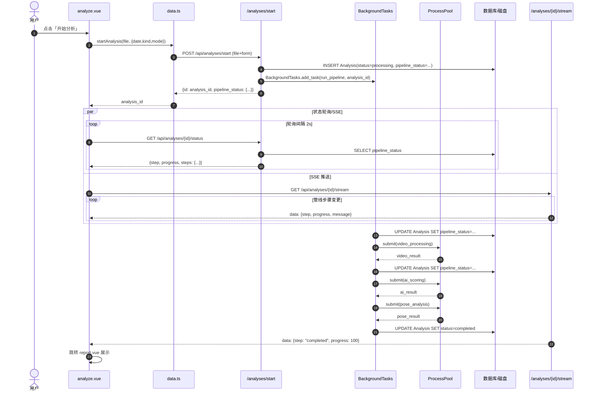

> **本页信息**
>
> | 项目 | 内容 |
> |------|------|
> | 文档编号 | 119 |
> | 文档版本 | v1.2.0 |
> | 文档状态 | 🚧 进行中 |
> | 最后更新 | 2026-08-30 |
> | 对应功能/内容 | 电子教练分析流程改造为后台任务队列+管线模式+状态管理：前端仅上传视频，后端异步执行完整分析管线，支持实时进度推送 |
>
> **变更历史**
>
> | 日期 | 版本 | 说明 |
> |------|:----:|------|
> | 2026-08-30 | v1.0.0 | 初版 |
> | 2026-08-30 | v1.1.0 | 前端状态订阅改为混合模式（轮询 + SSE），适配微信小程序 |
> | 2026-08-30 | v1.2.0 | 修复管线 5 个键名/路径 bug（video_url 键名、frame_urls 拼写、绝对路径存储、register_ai_files 路径转换、SSE 降级轮询） |
>
> **关联文档**：[118：分析流水线重构与视频信息表](./118-分析流水线重构与视频信息表.md)、[75-5：Phase4-电子教练小程序页](./75-5-Phase4-电子教练小程序页.md)

# 119：电子教练后台任务队列与管线模式

## 一、背景与根因

118 流水线将前端 5 步编排改为后端分步更新，但仍存在以下问题：

1. **前端复杂度高**：前端仍需编排 5 个 API 调用（init → upload → ai ∥ pose → finalize），使用 `Promise.allSettled` 并行执行，状态管理复杂。
2. **同步阻塞**：所有操作同步执行，AI 调用（5-60s）和姿态推理（3-90s）期间前端阻塞等待。
3. **超时风险**：前端超时设置（AI 120s、上传 120s、姿态 60s）在网络不稳定或服务繁忙时可能触发。
4. **无重试机制**：AI/ffmpeg 失败直接降级，无自动重试。
5. **无并发控制**：多用户同时上传/分析时，ffmpeg 和 MediaPipe 竞争 CPU 资源。
6. **用户体验差**：只能显示"分析中"，无法展示细粒度进度。

## 二、目标

1. **前端极简**：前端仅需 1 个上传调用 + 状态轮询/SSE 订阅。
2. **后台异步执行**：所有耗时操作（ffmpeg、AI、MediaPipe）在后台异步执行，无超时风险。
3. **管线模式**：将分析流程拆分为 5 个可编排的步骤，支持并行、重试、失败恢复。
4. **状态管理**：实时追踪每个步骤的进度，支持 SSE 实时推送。
5. **自动重试**：失败自动重试（最多 3 次，指数退避）。
6. **并发控制**：通过进程池限制并发数，避免资源竞争。

## 三、架构设计

### 3.1 技术选型

| 组件 | 推荐方案 | 备选方案 | 说明 |
|------|---------|---------|------|
| **任务队列** | FastAPI BackgroundTasks | ARQ + Redis | 轻量级，无需额外依赖 |
| **进程池** | concurrent.futures.ProcessPoolExecutor | Celery | CPU 密集操作（ffmpeg/MediaPipe） |
| **状态存储** | SQLite（扩展现有 Analysis 表） | Redis | 复用现有基础设施 |
| **实时推送** | 混合模式（轮询 + SSE） | 纯轮询 / 纯 SSE | 默认轮询，高级模式支持 SSE |

**推荐方案**：FastAPI BackgroundTasks + ProcessPoolExecutor + SQLite + 混合模式状态订阅

**混合模式说明**：
- **默认模式（轮询）**：每 2 秒查询一次状态，兼容所有基础库版本（≥ 2.10.0）
- **高级模式（SSE）**：基础库 ≥ 2.20.0 时，通过 `wx.request` 的 `enableChunked` 特性实现类 SSE 功能
- **自动降级**：检测到 `enableChunked` 不支持时，自动降级为轮询模式

### 3.2 管线设计

```
┌─────────────────────────────────────────────────────────────┐
│                    电子教练分析管线                           │
├─────────────────────────────────────────────────────────────┤
│  Step 0: 初始化     │  创建 Analysis 记录，获取 analysis_id  │
│  Step 1: 上传       │  视频上传 + 抽帧 + 裁剪               │
│  Step 2: AI 评分    │  六维评分（可并行）                    │
│  Step 3: 姿态推理   │  MediaPipe 推理 + 骨架视频（可并行）   │
│  Step 4: 收尾       │  更新 status=completed                │
└─────────────────────────────────────────────────────────────┘
```

### 3.3 状态机设计

```
                    ┌─────────────┐
                    │   pending   │
                    └──────┬──────┘
                           │ start()
                           ▼
                    ┌─────────────┐
          ┌────────│    init     │────────┐
          │        └─────────────┘        │
          │ success()                     │ fail()
          ▼                               ▼
   ┌─────────────┐                 ┌─────────────┐
   │   upload    │                 │   failed    │
   └──────┬──────┘                 └─────────────┘
          │ success()
          ▼
   ┌─────────────┐
   │   ai        │ ←─── 可并行
   │   pose      │ ←─── 可并行
   └──────┬──────┘
          │ both_success()
          ▼
   ┌─────────────┐
   │  finalize   │
   └──────┬──────┘
          │ success()
          ▼
   ┌─────────────┐
   │  completed  │
   └─────────────┘
```

### 3.4 时序图



## 四、数据模型

### 4.1 `analyses` 表新增字段（迁移）

| 字段 | 类型 | 说明 |
|------|------|------|
| `pipeline_status` | JSON | 管线状态，包含当前步骤、进度、各步骤状态 |

**示例值**：
```json
{
  "step": "ai",
  "progress": 65,
  "steps": {
    "init": {"status": "completed", "ts": 1234567890},
    "upload": {"status": "completed", "ts": 1234567891},
    "ai": {"status": "processing", "progress": 50},
    "pose": {"status": "pending"},
    "finalize": {"status": "pending"}
  },
  "error": null,
  "retry_count": 0
}
```

### 4.2 状态枚举

| 状态 | 说明 |
|------|------|
| `pending` | 等待执行 |
| `processing` | 执行中 |
| `completed` | 执行完成 |
| `failed` | 执行失败 |

### 4.3 步骤枚举

| 步骤 | 说明 |
|------|------|
| `init` | 初始化分析记录 |
| `upload` | 视频上传+抽帧+裁剪 |
| `ai` | AI 六维评分 |
| `pose` | 姿态推理+骨架视频 |
| `finalize` | 收尾更新状态 |

## 五、后端改动

### 5.1 新增进程池管理

**文件**：`app/core/process_pool.py`（新建）

```python
from concurrent.futures import ProcessPoolExecutor
import os

# 全局进程池单例
_process_pool: ProcessPoolExecutor | None = None

def get_process_pool() -> ProcessPoolExecutor:
    global _process_pool
    if _process_pool is None:
        max_workers = min(os.cpu_count() or 1, 4)  # 最多 4 个 worker
        _process_pool = ProcessPoolExecutor(max_workers=max_workers)
    return _process_pool

def shutdown_process_pool():
    global _process_pool
    if _process_pool:
        _process_pool.shutdown(wait=False)
        _process_pool = None
```

### 5.2 新增管线引擎

**文件**：`app/services/pipeline.py`（新建）

```python
from enum import Enum
from typing import Any
from loguru import logger
from sqlalchemy.orm import Session

class PipelineStep(str, Enum):
    INIT = "init"
    UPLOAD = "upload"
    AI = "ai"
    POSE = "pose"
    FINALIZE = "finalize"

class StepStatus(str, Enum):
    PENDING = "pending"
    PROCESSING = "processing"
    COMPLETED = "completed"
    FAILED = "failed"

class PipelineEngine:
    def __init__(self, db: Session, analysis_id: int):
        self.db = db
        self.analysis_id = analysis_id
        self.max_retries = 3
        self.retry_delay_base = 2  # 指数退避基数

    def update_step_status(self, step: PipelineStep, status: StepStatus, 
                          progress: int = 0, error: str | None = None):
        """更新管线状态"""
        # 列定向更新 pipeline_status
        ...

    def run_step(self, step: PipelineStep, func, *args, **kwargs) -> Any:
        """执行单个步骤，支持重试"""
        for attempt in range(self.max_retries):
            try:
                self.update_step_status(step, StepStatus.PROCESSING)
                result = func(*args, **kwargs)
                self.update_step_status(step, StepStatus.COMPLETED, progress=100)
                return result
            except Exception as e:
                logger.error(f"Pipeline step {step} failed (attempt {attempt+1}): {e}")
                if attempt < self.max_retries - 1:
                    import time
                    time.sleep(self.retry_delay_base ** attempt)
                else:
                    self.update_step_status(step, StepStatus.FAILED, error=str(e))
                    raise

    def run_pipeline(self, video_path: str, metadata: dict):
        """执行完整管线"""
        try:
            # Step 1: 上传+抽帧
            video_result = self.run_step(
                PipelineStep.UPLOAD, 
                self._process_video, 
                video_path, 
                metadata
            )
            
            # Step 2+3: 并行执行 AI + 姿态
            frame_urls = video_result["frame_urls"]
            
            import concurrent.futures
            from ..core.process_pool import get_process_pool
            
            pool = get_process_pool()
            with concurrent.futures.ThreadPoolExecutor(max_workers=2) as executor:
                ai_future = executor.submit(
                    self.run_step, PipelineStep.AI, 
                    self._analyze_ai, frame_urls, metadata
                )
                pose_future = executor.submit(
                    self.run_step, PipelineStep.POSE,
                    self._analyze_pose, frame_urls, video_result, metadata
                )
                
                ai_result = ai_future.result()
                pose_result = pose_future.result()
            
            # Step 4: 收尾
            self.run_step(PipelineStep.FINALIZE, self._finalize)
            
            return {"status": "completed", "ai": ai_result, "pose": pose_result}
            
        except Exception as e:
            logger.error(f"Pipeline failed for analysis {self.analysis_id}: {e}")
            self.update_step_status(PipelineStep.FINALIZE, StepStatus.FAILED, error=str(e))
            return {"status": "failed", "error": str(e)}

    def _process_video(self, video_path: str, metadata: dict):
        """视频处理（同步，将在进程池中执行）"""
        # 调用现有 video_service.process_video
        ...

    def _analyze_ai(self, frame_urls: list[str], metadata: dict):
        """AI 评分（同步）"""
        # 调用现有 ai_service.analyze_swing
        ...

    def _analyze_pose(self, frame_urls: list[str], video_result: dict, metadata: dict):
        """姿态推理（同步）"""
        # 调用现有 pose_service.analyze
        ...

    def _finalize(self):
        """收尾更新状态"""
        # UPDATE Analysis SET status='completed'
        ...
```

### 5.3 新增统一分析端点

**文件**：`app/routers/analyses.py`

```python
@router.post("/start")
async def start_analysis(
    file: UploadFile = File(...),
    date: str = Form(...),
    kind: str = Form(...),
    mode: str = Form(...),
    hit_time: float = Form(default=0.0),
    cuts: str | None = Form(default=None),
    background_tasks: BackgroundTasks = BackgroundTasks(),
    current_user: User = Depends(get_current_user),
    db: Session = Depends(get_db),
):
    """统一分析端点：上传视频并启动后台分析管线"""
    # 1. 创建 Analysis 记录
    analysis = Analysis(
        user_id=current_user.id,
        date=date,
        kind=kind,
        mode=mode,
        status="processing",
        pipeline_status={
            "step": "init",
            "progress": 0,
            "steps": {step.value: {"status": "pending"} for step in PipelineStep},
            "error": None,
            "retry_count": 0,
        },
        created_at=time.time(),
    )
    db.add(analysis)
    db.flush()
    analysis_id = analysis.id
    
    # 2. 保存视频文件
    video_path = await _save_uploaded_file(file, current_user.id)
    
    # 3. 启动后台任务
    metadata = {
        "date": date,
        "kind": kind,
        "mode": mode,
        "hit_time": hit_time,
        "cuts": json.loads(cuts) if cuts else None,
    }
    background_tasks.add_task(_run_analysis_pipeline, analysis_id, video_path, metadata)
    
    # 4. 返回初始状态
    return ApiResponse(data={
        "id": analysis_id,
        "status": "processing",
        "pipeline_status": analysis.pipeline_status,
    })

async def _run_analysis_pipeline(analysis_id: int, video_path: str, metadata: dict):
    """后台任务：执行分析管线"""
    from ..services.pipeline import PipelineEngine
    from ..core.database import SessionLocal
    
    db = SessionLocal()
    try:
        engine = PipelineEngine(db, analysis_id)
        engine.run_pipeline(video_path, metadata)
    finally:
        db.close()
```

### 5.4 新增状态查询端点

**文件**：`app/routers/analyses.py`

```python
@router.get("/{analysis_id}/status")
async def get_analysis_status(
    analysis_id: int,
    current_user: User = Depends(get_current_user),
    db: Session = Depends(get_db),
):
    """查询分析管线状态"""
    analysis = _get_owned_analysis(db, analysis_id, current_user)
    return ApiResponse(data={
        "id": analysis.id,
        "status": analysis.status,
        "pipeline_status": analysis.pipeline_status,
    })
```

### 5.5 新增 SSE 推送端点

**文件**：`app/routers/analyses.py`

```python
from fastapi.responses import StreamingResponse

@router.get("/{analysis_id}/stream")
async def stream_analysis_status(
    analysis_id: int,
    current_user: User = Depends(get_current_user),
    db: Session = Depends(get_db),
):
    """SSE 实时推送分析状态"""
    async def event_generator():
        last_status = None
        while True:
            # 查询最新状态
            analysis = _get_owned_analysis(db, analysis_id, current_user)
            current_status = {
                "step": analysis.pipeline_status.get("step"),
                "progress": analysis.pipeline_status.get("progress"),
                "steps": analysis.pipeline_status.get("steps"),
            }
            
            # 状态变更时推送
            if current_status != last_status:
                yield f"data: {json.dumps(current_status)}\n\n"
                last_status = current_status
            
            # 完成或失败时结束
            if analysis.status in ("completed", "failed"):
                yield f"data: {json.dumps({'status': analysis.status})}\n\n"
                break
            
            # 轮询间隔 2s
            await asyncio.sleep(2)
    
    return StreamingResponse(
        event_generator(),
        media_type="text/event-stream",
        headers={
            "Cache-Control": "no-cache",
            "Connection": "keep-alive",
        },
    )
```

### 5.6 扩展 Analysis 模型

**文件**：`app/models/analysis.py`

```python
class Analysis(Base):
    # ... 现有字段 ...
    pipeline_status = Column(JSON, nullable=True)  # 管线状态
```

### 5.7 数据库迁移

新增 Alembic 迁移文件：

```python
def upgrade():
    op.add_column('analyses', sa.Column('pipeline_status', sa.JSON(), nullable=True))

def downgrade():
    op.drop_column('analyses', 'pipeline_status')
```

## 六、前端改动（miniapp）

### 6.1 新增状态订阅服务（混合模式）

**文件**：`src/services/analysisStatus.ts`（新建）

```typescript
/**
 * 分析状态订阅服务（混合模式）
 * - 默认模式：轮询（兼容所有版本）
 * - 高级模式：SSE（基础库 ≥ 2.20.0 时启用）
 */

import { getBaseUrl } from '@/utils/request'

export interface PipelineStepStatus {
  status: 'pending' | 'processing' | 'completed' | 'failed'
  progress?: number
  ts?: number
  error?: string
}

export interface PipelineStatus {
  step: string
  progress: number
  steps: Record<string, PipelineStepStatus>
  error: string | null
  retry_count: number
}

export interface AnalysisStatus {
  id: number
  status: 'processing' | 'completed' | 'failed'
  pipeline_status: PipelineStatus
}

type StatusCallback = (status: AnalysisStatus) => void

/**
 * 检测是否支持 enableChunked（SSE 模式）
 */
function isChunkedSupported(): boolean {
  // 微信小程序基础库 ≥ 2.20.0 支持 enableChunked
  try {
    const systemInfo = uni.getSystemInfoSync()
    const version = systemInfo.SDKVersion || '0.0.0'
    const [major, minor] = version.split('.').map(Number)
    return major > 2 || (major === 2 && minor >= 20)
  } catch {
    return false
  }
}

/**
 * 轮询模式：定时查询状态
 */
class PollingSubscriber {
  private timer: ReturnType<typeof setInterval> | null = null
  private analysisId: number
  private callback: StatusCallback
  private token: string

  constructor(analysisId: number, callback: StatusCallback) {
    this.analysisId = analysisId
    this.callback = callback
    this.token = uni.getStorageSync('token')
  }

  start() {
    // 立即查询一次
    this.fetchStatus()
    
    // 每 2 秒轮询
    this.timer = setInterval(() => {
      this.fetchStatus()
    }, 2000)
  }

  private async fetchStatus() {
    try {
      const baseUrl = getBaseUrl()
      const res = await uni.request({
        url: `${baseUrl}/api/analyses/${this.analysisId}/status`,
        method: 'GET',
        header: {
          'X-Auth-Token': this.token,
        },
      })
      
      if (res.statusCode === 200 && res.data?.data) {
        this.callback(res.data.data as AnalysisStatus)
      }
    } catch (e) {
      console.error('[PollingSubscriber] 查询状态失败:', e)
    }
  }

  stop() {
    if (this.timer) {
      clearInterval(this.timer)
      this.timer = null
    }
  }
}

/**
 * SSE 模式：通过 enableChunked 实现类 SSE
 */
class SSESubscriber {
  private requestTask: any = null
  private analysisId: number
  private callback: StatusCallback
  private token: string
  private buffer: string = ''

  constructor(analysisId: number, callback: StatusCallback) {
    this.analysisId = analysisId
    this.callback = callback
    this.token = uni.getStorageSync('token')
  }

  start() {
    const baseUrl = getBaseUrl()
    
    this.requestTask = uni.request({
      url: `${baseUrl}/api/analyses/${this.analysisId}/stream`,
      method: 'GET',
      enableChunked: true,
      header: {
        'X-Auth-Token': this.token,
      },
    })

    // 监听分块数据
    this.requestTask.onChunkReceived?.((res: { data: ArrayBuffer }) => {
      this.handleChunk(res.data)
    })

    this.requestTask.on?.('chunkReceived', (res: { data: ArrayBuffer }) => {
      this.handleChunk(res.data)
    })
  }

  private handleChunk(data: ArrayBuffer) {
    // ArrayBuffer 转字符串
    const uint8Array = new Uint8Array(data)
    let text = ''
    for (let i = 0; i < uint8Array.length; i++) {
      text += String.fromCharCode(uint8Array[i])
    }
    
    // 尝试 UTF-8 解码
    try {
      text = decodeURIComponent(escape(text))
    } catch {
      // 解码失败使用原始文本
    }

    this.buffer += text

    // 解析 SSE 格式：data: {...}\n\n
    const lines = this.buffer.split('\n')
    this.buffer = lines.pop() || '' // 保留未完成的行

    for (const line of lines) {
      if (line.startsWith('data: ')) {
        const jsonStr = line.slice(6).trim()
        if (jsonStr) {
          try {
            const status = JSON.parse(jsonStr) as AnalysisStatus
            this.callback(status)
          } catch (e) {
            console.error('[SSESubscriber] JSON 解析失败:', e)
          }
        }
      }
    }
  }

  stop() {
    if (this.requestTask) {
      this.requestTask.abort()
      this.requestTask = null
    }
  }
}

/**
 * 创建状态订阅器（自动选择模式）
 */
export function createStatusSubscriber(
  analysisId: number,
  callback: StatusCallback
): { start: () => void; stop: () => void } {
  if (isChunkedSupported()) {
    console.log('[AnalysisStatus] 使用 SSE 模式')
    return new SSESubscriber(analysisId, callback)
  } else {
    console.log('[AnalysisStatus] 使用轮询模式')
    return new PollingSubscriber(analysisId, callback)
  }
}

/**
 * 查询分析状态（单次）
 */
export async function getAnalysisStatus(id: number): Promise<AnalysisStatus> {
  const baseUrl = getBaseUrl()
  const token = uni.getStorageSync('token')
  
  const res = await uni.request({
    url: `${baseUrl}/api/analyses/${id}/status`,
    method: 'GET',
    header: {
      'X-Auth-Token': token,
    },
  })
  
  if (res.statusCode === 200 && res.data?.data) {
    return res.data.data as AnalysisStatus
  }
  
  throw new Error('查询分析状态失败')
}
```

### 6.2 简化分析页面

**文件**：`src/pages/coach/analyze.vue`

```typescript
import { createStatusSubscriber, type AnalysisStatus } from '@/services/analysisStatus'

let statusSubscriber: { stop: () => void } | null = null

async function startAnalysis() {
  analyzing.value = true
  
  try {
    // 1. 调用统一端点
    const res = await startAnalysisApi(videoPath.value, {
      date: date.value,
      kind: kind.value,
      mode: mode.value,
      hitTime: hitTime.value,
      cuts: cuts.value,
    })
    
    const analysisId = res.id
    
    // 2. 创建状态订阅器（自动选择轮询或 SSE）
    statusSubscriber = createStatusSubscriber(analysisId, (status: AnalysisStatus) => {
      // 更新进度条
      currentStep.value = status.pipeline_status.step
      progress.value = status.pipeline_status.progress
      steps.value = status.pipeline_status.steps
      
      // 完成时跳转报告页
      if (status.status === 'completed') {
        statusSubscriber?.stop()
        uni.redirectTo({ url: `/pages/coach/report?id=${analysisId}` })
      }
      
      // 失败时提示
      if (status.status === 'failed') {
        statusSubscriber?.stop()
        uni.showToast({ title: '分析失败，请重试', icon: 'none' })
      }
    })
    
    // 3. 启动订阅
    statusSubscriber.start()
    
  } catch (e) {
    uni.showToast({ title: '启动分析失败', icon: 'none' })
  } finally {
    analyzing.value = false
  }
}

// 页面卸载时取消订阅
onUnmounted(() => {
  statusSubscriber?.stop()
  statusSubscriber = null
})
```

### 6.3 进度条 UI

**文件**：`src/pages/coach/analyze.vue`

```vue
<template>
  <view class="progress-container">
    <view class="progress-bar">
      <view class="progress-fill" :style="{ width: `${progress}%` }" />
    </view>
    <view class="progress-text">
      <text>{{ stepLabels[currentStep] }}</text>
      <text>{{ progress }}%</text>
    </view>
    <view class="steps-list">
      <view v-for="(step, key) in steps" :key="key" class="step-item">
        <view :class="['step-icon', step.status]">
          <text v-if="step.status === 'completed'">✓</text>
          <text v-else-if="step.status === 'processing'">⏳</text>
          <text v-else>○</text>
        </view>
        <text>{{ stepLabels[key] }}</text>
      </view>
    </view>
  </view>
</template>

<script setup>
const stepLabels = {
  init: '初始化',
  upload: '上传视频',
  ai: 'AI 评分',
  pose: '姿态推理',
  finalize: '完成',
};
</script>
```

### 6.4 类型定义

类型定义已整合到 `src/services/analysisStatus.ts` 中（见 6.1 节），包含：

- `PipelineStepStatus` - 步骤状态
- `PipelineStatus` - 管线状态
- `AnalysisStatus` - 分析状态

如需在其他文件引用，可从 `analysisStatus.ts` 导入：

```typescript
import type { AnalysisStatus, PipelineStatus } from '@/services/analysisStatus'
```

## 七、错误处理与重试

### 7.1 重试策略

| 步骤 | 最大重试次数 | 退避策略 | 说明 |
|------|------------|---------|------|
| init | 0 | - | 不重试 |
| upload | 2 | 指数退避（2s, 4s） | 文件上传失败可重试 |
| ai | 3 | 指数退避（2s, 4s, 8s） | AI API 调用不稳定 |
| pose | 2 | 指数退避（2s, 4s） | MediaPipe 推理偶发失败 |
| finalize | 1 | 立即重试 | 仅更新状态，几乎不会失败 |

### 7.2 失败恢复

- **从失败步骤恢复**：跳过已完成步骤，从失败步骤重新开始
- **保留中间结果**：已生成的帧、骨架视频不删除，重试时可复用
- **孤儿记录清理**：`status=processing` 超过 30 分钟的记录，定时任务标记为 `failed`

### 7.3 降级策略

- **AI 失败**：返回本地降级报告（score=0），不影响其他步骤
- **姿态推理失败**：返回 `detected=false`，不影响报告展示
- **SSE 失败**：降级为轮询模式，前端自动切换

## 八、并发控制

### 8.1 进程池限制

```python
# 最多 4 个 worker（每个 worker 处理一个分析任务）
max_workers = min(os.cpu_count() or 1, 4)
```

### 8.2 队列长度监控

```python
@router.get("/pipeline/status")
async def get_pipeline_status():
    """获取管线运行状态（Admin 用）"""
    pool = get_process_pool()
    return {
        "max_workers": pool._max_workers,
        "active_tasks": pool._adjust_thread_count(),
        "queue_length": pool._work_queue.qsize(),
    }
```

### 8.3 限流

- 单用户同时最多 1 个分析任务
- 全局最多 10 个排队任务（超出返回 429）

## 九、测试

### 9.1 单元测试

```python
# tests/services/test_pipeline.py
def test_pipeline_engine_steps():
    """测试管线引擎步骤执行"""
    ...

def test_pipeline_retry_on_failure():
    """测试失败重试机制"""
    ...

def test_pipeline_concurrent_execution():
    """测试 AI + 姿态并行执行"""
    ...
```

### 9.2 集成测试

```python
# tests/routers/test_analysis_pipeline_async.py
def test_start_analysis_endpoint():
    """测试统一分析端点"""
    ...

def test_status_query_endpoint():
    """测试状态查询端点"""
    ...

def test_sse_stream():
    """测试 SSE 推送"""
    ...
```

### 9.3 验证命令

```bash
cd server && uv run ruff check . && uv run ruff format . && uv run pytest -m fast
cd miniapp && pnpm run type-check && pnpm run build:mp-weixin
```

## 十、迁移策略

### 10.1 兼容性

- **保留现有 5 个独立端点**：init、upload、ai、pose、finalize 继续可用
- **新增统一端点**：`POST /api/analyses/start` 作为新入口
- **渐进迁移**：前端可逐步从旧方案迁移到新方案
- **降级方案**：新方案失败时可回退到旧方案

### 10.2 数据兼容

- `pipeline_status` 字段为 JSON，旧记录为 `null`，前端需兼容处理
- 历史记录无 `pipeline_status` 时，直接显示最终状态

## 十一、关联文档

- [118：分析流水线重构与视频信息表](./118-分析流水线重构与视频信息表.md)（本计划前置）
- [75-5：Phase4-电子教练小程序页](./75-5-Phase4-电子教练小程序页.md)
- [75-1：AI 评分代理接口](./75-1-AI评分代理接口.md)
- [75-2：视频上传与抽帧](./75-2-视频上传与抽帧.md)
- [75-3：MediaPipe 姿态推理](./75-3-MediaPipe姿态推理.md)
- [75-4：分析报告落库与历史查询](./75-4-分析报告落库与历史查询.md)
