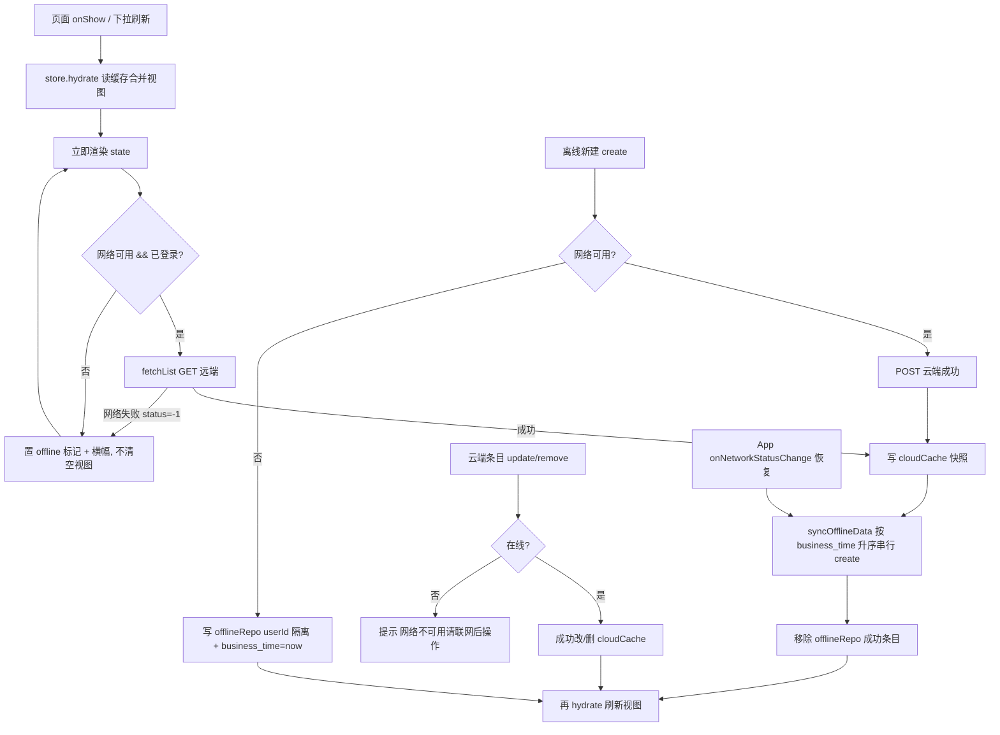

> **本页信息**
>
> | 项目 | 内容 |
> |------|------|
> | 文档编号 | 141 |
> | 文档版本 | v1.0.0 |
> | 文档状态 | 📋 待执行 |
> | 最后更新 | 2026-09-11 |
> | 对应功能/内容 | 登录态日记/装备/体重/分析记录离线缓存与自动同步 |
>
> **变更历史**
>
> | 日期 | 版本 | 说明 |
> |------|:----:|------|
> | 2026-09-11 | v1.0.0 | 初版 |
>
> **关联文档**：[129：日记装备统计游客本地降级与登录同步](./129-日记装备统计游客本地降级与登录同步.md)、[135：游客同步顺序修复与业务时间字段](./135-游客同步顺序修复与业务时间字段.md)

# 登录态离线缓存与自动同步

## 产品概述

为**已登录用户**的日记/装备/体重/分析记录增加离线可用能力：**本地缓存作为列表与详情渲染的唯一数据源**，页面先渲染缓存合并视图再按需刷新；网络不可用或远程服务异常时仍可浏览缓存并新建记录（入本地待同步仓库），网络恢复后自动静默同步；游客态现有本地降级机制（Step 129）保持零改动。

## 核心功能

- **统一缓存渲染源（架构统一）**：登录态日记/装备/体重列表与详情的渲染源恒等于 `merge(账号云端快照缓存, 账号离线新建待同步)`。页面 onShow/进入先 hydrate 缓存立即展示；**仅当网络可用且已登录**才请求远端，成功后刷新云端快照缓存并自动同步离线新建，再由缓存驱动视图更新；页面不存在"在线读云端 / 离线回退缓存"的双分支逻辑。
- **离线浏览**：请求失败只标记「离线/缓存」状态并显示横幅，**绝不因失败清空或覆盖当前缓存视图**；首次且无缓存时才展示"网络不可用"空态。分析记录可离线浏览列表与文字报告（分数/点评/pose 等 JSON），视频/封面等媒体离线统一本地占位、不发起请求、不黑屏破图。
- **离线新建（写降级）**：断网时仍可新建日记/装备/体重，写入账号隔离的本地待同步仓库并即时出现在合并视图（带「待同步」标记）；恢复后按 business_time 升序自动同步。分析新建依赖服务端视频/AI/姿态流水线，离线入口提示需网络。
- **编辑/删除门禁**：已同步云端条目（数字 id）在线操作成功后才更新缓存视图，离线时明确提示「网络不可用，请联网后操作」；未同步本地条目（localId）允许离线编辑/删除（纯本地操作）。游客路径不变。
- **自动同步**：网络恢复（onNetworkStatusChange）/ 登录成功 / 下拉刷新在线成功后自动静默同步离线新建；冲突按时间戳后写胜（business_time），同步结果轻提示 + 埋点。
- **账号隔离与健壮性**：缓存与待同步仓库键按 userId 隔离（`td_*_{userId}_*`），登出/换号不串数据；沿用 900KB 单键容量保护、JSON 损坏容错、封面 dataURL 压缩先例。

## 技术栈

- 小程序前端：uni-app（Vue 3 + Vite + TypeScript）+ Pinia；本地存储 `uni.setStorageSync`（单 key ~1MB，总量 10MB）
- 复用现有三件套：pendingRepo（游客本地仓库）/ sync.ts（游客迁移）/ 双路径 store，泛化为「账号级离线仓库 + 云端快照缓存」的统一缓存源架构
- 后端**零改动**：`business_time` 字段与 create 接口已支持（Step 135 先例）

## 实现思路

将渲染源收敛为本地缓存合并视图，远端只负责"拉取 → 刷新缓存"，页面只消费 store 内存态：

**渲染契约（数据驱动、渲染层零分支）**：列表/详情/空态/横幅一律只绑定 store 的 state 与 getter（如每条 `pending` 待同步标记、列表项 `thumb/photo/video`、store 级 `offline/fromCache` 标志、`loading`）渲染，页面组件内不出现"是否在线/离线/游客"的数据源分支，也不持有独立数据集合；数据从哪来完全由 store/service 决定并输出统一内存态（成功 fetch → 写账号缓存 → setState；失败/离线 → 保持缓存视图仅置标志；游客 → 读 td_pending_*），页面唯一职责是调用 action 并展示结果。

**加载态（loading）规则**：store 统一暴露 `loading`（远端加载/刷新中），列表渲染三态由 state 决定——`loading && list 为空` → 显示加载中占位（骨架/进度指示）；`loading && list 有内容` → 列表照常渲染，仅叠加轻量"刷新中"提示，不遮挡、不闪烁；请求 settle（成功/失败）即置 `loading=false`；空态仅在 `!loading && list 为空` 时展示，用于区分"加载中"与"确实无数据/离线无缓存"。首屏 `hydrate()` 为同步本地读、不置 loading；下拉刷新沿用系统下拉指示器并与 `loading` 联动。

1. **抽取通用存储基座 `storageBase.ts`**：自 pendingRepo 下沉 `load/persist/estimateSize(900KB 容量保护)/损坏容错/genLocalId`；pendingRepo 改为复用基座，**对外 API、游客键、行为完全不变**。
2. **新增账号隔离仓库（零 store 依赖，防循环）**：
   - `offlineRepo.ts`：登录态离线新建待同步仓库，键 `td_offline_{userId}_diaries/gears/weights`，实体复用 LocalDiary/LocalGear/LocalWeight（PendingMeta + business_time=now），提供按 userId 的 get/upsert/update/remove；
   - `cloudCache.ts`：账号隔离云端快照，键 `td_cache_{userId}_diaries/gears/weights/analyses`（列表 + updatedAt meta）；分析详情按 LRU 上限 20 条存 `td_cache_{userId}_analysis_{id}`。
3. **store 数据源统一为缓存合并视图**（diary/gear/weight 三 store 同构改造）：
   - 登录态 `state` 恒 = merge(cloudCache 列表, offlineRepo 列表)，排序/口径与现有一致（如按日期倒序、AnyXxx 联合实体、getEntryId/isLocalEntry 消费方式不变）；
   - 新增 `hydrate()`：从缓存合并视图重建 state（游客态等价于现有 getPendingXxx 载入）；页面 onShow 先调用 → 立即渲染；
   - `fetchList()` 改为**仅刷新缓存**：登录 + 网络可用才 GET；成功 → 写 cloudCache → hydrate，并顺带触发 syncOfflineData（成功后 offlineRepo 移除、再 hydrate，无重复）；失败（ApiError.status === -1 / 超时）→ 置 `offline/fromCache` 标记并抛可提示错误，**不清空 state**；
   - `create()`：在线成功 → POST 返回记录写 cloudCache → hydrate；网络失败 → 写 offlineRepo → hydrate（头插待同步）；游客路径不变；
   - `update/remove()`：数字 id 云端条目成功 → 改/删 cloudCache → hydrate；失败 → 提示「网络不可用，请联网后操作」；localId 本地条目 → 纯本地改 offlineRepo → hydrate；游客路径不变；
   - 判定离线：仅 `ApiError.status === -1`（网络层失败）视为离线降级；4xx 业务错误不降级（避免掩盖业务失败），401 仍走既有 clearAuth/登出。
4. **分析记录接入**：coach.vue 列表 / report.vue 详情渲染源 = analyses 快照缓存；在线成功刷新缓存，未命中缓存且离线 → 提示；`<image>/<video>` 媒体统一走 `resolveMediaSrc(url, networkOnline)`（utils/media.ts）——远程 URL 离线时返回本地占位素材 `static/offline-media.png`，dataURL/本地路径原样；`<image>` 保留 `@error` 兜底换占位（防 URL 失效/鉴权 401），离线 `<video>` 不加载并显示「网络不可用」遮罩。
5. **自动同步**：`sync.ts` 新增 `syncOfflineData()`（与 `syncPendingLocalData` 并存：独立 `syncingOffline` 防并发锁；读 offlineRepo 按 business_time 升序串行 create；单条失败保留并计数；装备 dataURL 封面复用 `dataUrlToTempFile → uploadGearImage` 流程；成功移除条目并回调刷新相关 store 视图；轻提示 + 埋点）。触发点：App.vue `uni.onNetworkStatusChange` 网络恢复、mine.vue 登录成功回调（先 syncPendingLocalData 迁移游客数据，再 syncOfflineData 补传登录期离线）、各列表下拉刷新在线成功后顺带。
6. **stats 页兜底**：登录态 `getStats` 失败时，基于本地缓存 diaries/gears（cloudCache + offlineRepo 合并）用 `aggregateLocalStats` 聚合兜底并标记「离线统计」；口径对齐后端 `/api/stats`。
7. **网络态**：App.vue 维护全局 `networkOnline`（onNetworkStatusChange），供横幅、媒体占位、写操作门禁共享；store 离线标记与之联动，避免各页各自探测。

## 实现注意（执行时先读代码确认，防回归）

- **先确认事实再动手**：读 `stores/auth.ts` 确认 userId/isGuest 字段名；读 diary/gear/weight store 全文与 `pages/diary|gear|stats|coach|mine/*.vue` 的 onShow/onPullDownRefresh/表单提交调用点；gear 无独立详情页（封面在 gear.vue 列表/弹层），report.vue 媒体字段逐个确认（video_url/thumb/highlights/pose 图）；share.vue 亦调 getDiaries/getAnalyses，媒体占位可顺带接入但不扩大改造面。
- **兼容与容量**：游客路径、pendingRepo 既有 API、`syncPendingLocalData` 行为零改动；新键全部收口 `constants/storage.ts`（td_ 前缀）；列表/文字报告为 KB 级，沿用 900KB/键阈值；装备离线封面沿用 `compressImageToDataURL`（Step 134），超限 toast「本地空间不足，请联网同步」。
- **防重复/防并发**：offline 条目同步成功后必须先从 offlineRepo 移除再 hydrate，避免与云端列表重复展示；hydrate 与 fetch 结果写回串行（fetch 返回后统一写缓存再 hydrate，避免并发覆盖旧缓存）；syncOfflineData 与 syncPendingLocalData 各自独立锁。
- **埋点与日志**：沿用 eventLogger（trace_id + 事件名），新增 `offline_cache_hit / offline_create_pending / offline_sync_done / offline_sync_failed / media_offline_placeholder`；不打印 photo/notes/报告大字段。
- **登出语义**：登出/401 不清缓存（下次登录离线可看，重新在线拉取自动覆盖）；不引入「清除缓存」设置项（YAGNI）。

## 架构设计（数据流）



## 目录结构

```
docs/plans/141-登录态离线缓存与自动同步.md   # [NEW] 方案文档（现状/设计/验证清单，经 docs-manage 编号入索引）
miniapp/src/services/storageBase.ts          # [NEW] 通用存储基座：load/persist/900KB 容量保护/损坏容错/genLocalId（自 pendingRepo 下沉）
miniapp/src/services/offlineRepo.ts          # [NEW] 登录态账号隔离待同步仓库（by userId 的 get/upsert/update/remove；实体 LocalXxx + business_time=now；零 store 依赖）
miniapp/src/services/cloudCache.ts           # [NEW] 账号隔离云端快照（diaries/gears/weights/analyses 列表 + updatedAt；分析详情 LRU≤20）
miniapp/src/services/pendingRepo.ts          # [MODIFY] 改用 storageBase，对外 API/游客键/行为完全不变
miniapp/src/services/sync.ts                 # [MODIFY] 新增 syncOfflineData()（独立锁、business_time 升序、装备封面 dataURL 上传复用、回调刷新视图）
miniapp/src/services/localStats.ts           # [MODIFY 或不动] 确认是否需按 cloudCache 口径补充登录态聚合入口
miniapp/src/constants/storage.ts             # [MODIFY] 账号隔离键生成函数（offline/cache 前缀）统一收口
miniapp/src/types/index.ts                   # [MODIFY] 缓存 meta（快照 updatedAt）、账号键参数等少量补充；尽量复用 LocalXxx/AnyXxx
miniapp/src/utils/media.ts                   # [NEW] resolveMediaSrc(url, online)：离线/远程 URL → 本地占位；dataURL/本地路径原样
miniapp/src/static/offline-media.png         # [NEW] 离线媒体占位图（本地静态资源，不依赖网络）
miniapp/src/stores/diary.ts                  # [MODIFY] 缓存合并视图为渲染源：hydrate/fetch 刷新缓存（暴露 loading 三态）/离线 create 落 offlineRepo/云端条目离线门禁
miniapp/src/stores/gear.ts                   # [MODIFY] 同上（含离线封面压缩路径）
miniapp/src/stores/weight.ts                 # [MODIFY] 同上
miniapp/src/pages/diary/diary.vue            # [MODIFY] onShow 先 hydrate；离线横幅/待同步标记；下拉刷新在线后触发同步
miniapp/src/pages/diary/form.vue             # [MODIFY] 提交走新 create/update 语义提示；本地待同步条目离线可编辑
miniapp/src/pages/gear/gear.vue              # [MODIFY] 同上 + 封面 <image> resolveMediaSrc 占位接入
miniapp/src/pages/gear/form.vue              # [MODIFY] 同上
miniapp/src/pages/stats/stats.vue            # [MODIFY] getStats 失败 → 本地缓存聚合兜底 + 离线标记
miniapp/src/pages/coach/coach.vue            # [MODIFY] 列表渲染源=analyses 缓存；在线刷新；下拉刷新同步
miniapp/src/pages/coach/report.vue           # [MODIFY] 详情渲染源=分析缓存 + 媒体离线占位（<image>@error、<video> 遮罩）
miniapp/src/App.vue                          # [MODIFY] 维护 networkOnline（onNetworkStatusChange）+ 网络恢复触发 syncOfflineData
miniapp/src/pages/mine/mine.vue              # [MODIFY] 登录成功回调：syncPendingLocalData 后追加 syncOfflineData
```

## 验证

- `cd miniapp && pnpm run type-check && pnpm run build:mp-weixin` 通过后方可提交
- 手动场景：断网浏览（缓存命中 / 首次无缓存空态）、断网新建三实体本地可见带待同步标记、恢复后自动同步无重复、换号/登出隔离、游客路径回归、stats 离线聚合兜底、装备封面/分析缩略图/报告视频离线占位不破图
- 列表加载态：首次进入无缓存时列表显示 loading 占位；有缓存时直接渲染缓存、远端刷新期间仅轻量提示不遮挡不闪烁；loading 结束才展示空态；下拉刷新指示器正常联动
