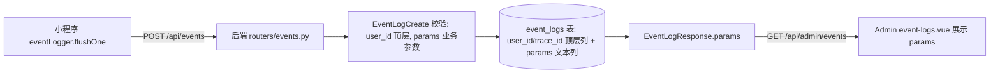

> **本页信息**
>
> | 项目 | 内容 |
> |------|------|
> | 文档编号 | 142 |
> | 文档版本 | v1.0.0 |
> | 文档状态 | 📋 待执行 |
> | 最后更新 | 2026-09-11 |
> | 对应功能/内容 | 小程序埋点补盲（setTheme/analysis 列表）、share 冗余精简、扩展字段 params 重构与调用方冗余清理 |
>
> **变更历史**
>
> | 日期 | 版本 | 说明 |
> |------|:----:|------|
> | 2026-09-11 | v1.0.0 | 初版 |
>
> **关联文档**：[107-小程序埋点上报优化](./107-小程序埋点上报优化.md)、[59-小程序事件锚点与线上事件日志](./59-小程序事件锚点与线上事件日志.md)、[59-v1.1-业务动作埋点与精确时间](./59-业务动作埋点与精确时间.md)、[62-Admin事件日志详情弹窗](./62-Admin事件日志详情弹窗.md)、[102-操作审计日志](./102-操作审计日志.md)

# 小程序埋点补盲、冗余精简与扩展字段重构

## 一、背景与现状

基于小程序端埋点审查，现有埋点采用「操作级 + `createTraceId` 链路」模式（store 业务三态「开始/成功/失败」+ `trace_id` 串联 + request 层错误 + App 全局错误 + 页面关键交互），整体规范。审查发现三类问题：

1. **缺失项**：`settings.setTheme`（球场主题切换，用户偏好操作，产品分析价值高）与 `analysis.fetchList` 离线/失败降级分支无任何埋点。
2. **冗余项**：`share.vue` 同时存在整体 `share_data_load_start` / `share_data_load_success` 与分端点 `share_load_diaries_*`、`share_load_analyses_*` 日志，整体日志与分端点重复。
3. **字段层级混淆**：上报体的 `extra` 字段既承载业务参数，又混入 `trace_id`（调用方手写）与 `user_id`（部分调用手写），与顶层表字段语义重叠；后端再从 `extra` 取出 `user_id` 写表列，造成链路/身份标识在「顶层列」与「扩展字段」中两处重复。

**埋点核心用途（设计原则）**：上报用于回答「**谁**（顶层 `user_id`）在**链路** `trace_id` 下，对**什么资源**（`params` 中的业务参数）进行了**什么操作**（顶层 `action`）」。因此 `params` 应纯业务化，仅保留描述"资源 + 操作"的上下文参数；`trace_id` / `user_id` 这类元信息由 `flushOne` 统一置顶层，不应出现在 `params` 内。

## 二、目标

1. 补埋明确缺失的 2 处埋点（`theme_change`、`analysis_list_offline` / `analysis_list_load_failed`）。
2. 精简 `share.vue` 重复加载日志（保留分端点日志与 `t0`）。
3. 重构事件上报负载结构：业务参数统一包在 `params` 字段下，`trace_id` / `user_id` 提为顶层表字段；后端存储列 `extra` 重命名为 `params`；Admin 查询与展示同步使用 `params`。
4. 在本次 params 重构中**一并清理**调用方 `extra` 中冗余的 `trace_id: traceId` 与 `auth.ts` 手动 `user_id`，使 `params` 纯业务化（约 50+ 处机械化删除）。

**不改动**：不新增页面访问 PV 埋点（保持现有操作级埋点哲学）；不改动 `events` 之外的任何业务逻辑。

## 三、关键信息流（重构后）



上报请求体（重构后）：

```json
{
  "level": "info",
  "type": "custom",
  "trace_id": "<顶层链路 ID>",
  "user_id": 123,
  "action": "weight_create",
  "message": "记录体重",
  "stack": "",
  "page": "",
  "params": { "date": "2026-09-11", "weight": 72.5 },
  "device_info": {},
  "client_time": 1234567890
}
```

## 四、改动清单

### 4.1 补埋缺失项（小程序）

| 文件 | 改动 |
|------|------|
| `miniapp/src/stores/settings.ts` | `setTheme(key)` 切换成功后新增 `theme_change` 埋点：`logInfo("切换球场主题", { theme: key }, undefined, "theme_change", createTraceId())`；新增 `import { createTraceId, logInfo } from "@/utils/eventLogger"` |
| `miniapp/src/stores/analysis.ts` | `fetchList()` 无网络分支新增 `logWarn(..., "analysis_list_offline", ...)`；catch `status === -1` 降级分支新增 `logWarn(..., "analysis_list_load_failed", ...)`；新增 `import { createTraceId, logWarn } from "@/utils/eventLogger"` |

离线降级属预期静默降级，用 `logWarn` 而非 `logError`，与 request 层网络/HTTP 错误 `logError` 不冲突。

### 4.2 精简冗余日志（小程序）

`miniapp/src/pages/share/share.vue` onShow：
- **必须保留** `const t0 = Date.now()`（失败日志 `total_duration_ms` 依赖）。
- 删除整体 `share_data_load_start` 与 `share_data_load_success` 两块。
- 保留两分端点 `share_load_diaries_start/success` 与 `share_load_analyses_start/success`，以及 `share_data_load_failed`（含 `total_duration_ms`）。

### 4.3 小程序扩展字段重构 — flushOne

`miniapp/src/utils/eventLogger.ts` `flushOne`：
- body 改为顶层 `user_id`（若 `userId` 存在）、`params: payload.extra || {}`。
- 删除 `extra` 顶层字段，删除 `body.extra.user_id = userId` 注入。
- `device_info` 保留顶层；`trace_id` 本就在顶层（`trace_id: payload.traceId`），无需移动。

### 4.4 小程序调用点清理（冗余删除）

遍历 `miniapp/src` 全部 `logInfo/logWarn/logError/logFatal` 调用（分布于 `services/sync.ts`、`stores/weight.ts`、`stores/gear.ts`、`stores/diary.ts`、`stores/auth.ts`、`pages/share/share.vue`、`pages/coach/report.vue`、`pages/coach/analyze.vue`、`App.vue` 等）：
- 对每个调用的 `extra`（第 2 参数对象）删除 `trace_id: <var>` 键。
- 若删除后 `extra` 仍有业务字段（如 `date`/`weight`/`gear_id`/`error`/`duration_ms`/`template`/`nickname`），保留该对象；若仅含 `trace_id`（如 `share.vue` 原 `{ trace_id: traceId }`），则省略该参数（传 `undefined` 或 `{}`）。
- `stores/auth.ts`（profile_update 调用）额外删除 `user_id: user.id`，保留 `nickname`。
- 调用末参 `traceId` 保持不变（确保 `trace_id` 顶层链路不断）。

函数签名（清理前已确认，删除 `extra` 内键不影响其他参数位）：
- `logInfo(message, extra?, type?, action?, traceId?)`
- `logWarn(message, extra?, type?, action?, traceId?)`
- `logError(message, extra?, type?, action?, stack?, traceId?)`
- `logFatal(message, extra?, stack?, traceId?)`

### 4.5 后端扩展字段重构

| 文件 | 改动 |
|------|------|
| `server/app/models/event_log.py` | 列 `extra` 重命名为 `params`（含 comment="业务参数 JSON"） |
| `server/app/schemas/schemas.py` | `EventLogCreate` 删 `extra`、新增 `user_id: int \| None = None` 与 `params: dict = {}`；`EventLogResponse` 删 `extra` 改 `params: dict = {}`；`@field_validator("params", "device_info", mode="before")` |
| `server/app/routers/events.py` | 删除 `user_id = body.extra.get("user_id")` 解析块；`EventLog(..., user_id=body.user_id, params=json.dumps(body.params, ensure_ascii=False), device_info=json.dumps(body.device_info, ensure_ascii=False))` |
| `server/alembic/versions/<new>_rename_event_logs_extra_to_params.py` | `op.execute("ALTER TABLE event_logs RENAME COLUMN extra TO params")`；`down_revision` 指向当前 alembic head（执行时以 `alembic heads` 为准）；旧数据 `params` 列可能残留历史 `user_id` 键，无害不清理 |

重构后 schema 核心结构：

```python
class EventLogCreate(BaseModel):
    level: str
    type: str = "custom"
    trace_id: str | None = None
    user_id: int | None = None          # 顶层表字段，不再从 extra 取
    action: str | None = None
    message: str
    stack: str = ""
    page: str = ""
    params: dict = {}                   # 业务参数，原 extra
    device_info: dict = {}
    client_time: int | None = None

class EventLogResponse(BaseModel):
    id: int
    user_id: int | None
    level: str
    type: str = "custom"
    trace_id: str | None
    action: str | None
    message: str
    stack: str = ""
    page: str = ""
    params: dict = {}                   # 原 extra
    device_info: dict = {}
    client_time: int | None
    created_at: float
    model_config = {"from_attributes": True}
```

### 4.6 Admin 前端同步

| 文件 | 改动 |
|------|------|
| `admin/src/api/events.ts` | `EventLog` 接口 `extra` → `params` |
| `admin/src/views/system/event-logs.vue` | 第 253、255 行 `selectedEvent.extra` → `selectedEvent.params` |

### 4.7 影响确认

全量 `grep` 确认 `EventLog` / `EventLogCreate` / `EventLogResponse` 引用点仅限 `event_log.py`、`schemas.py`、`routers/events.py`、`routers/admin/events.py`、Admin 前端 `api/events.ts` 与 `event-logs.vue`，无隐藏构造点、无测试覆盖，改动安全。

## 五、实施注意

- 埋点调用零阻塞：`logInfo`/`logWarn` 走批量防抖、失败本地缓存兜底，新增埋点不改 `setTheme` / `fetchList` / `share.onShow` 时序。
- 清理调用点机械化删除前，先精确读取 `eventLogger.ts` 各函数签名确认参数顺序，避免误删破坏签名。
- `share.vue` 精简务必保留 `const t0 = Date.now()`；仅删整体 start/success 两块。
- 迁移 `down_revision` 执行时以 `alembic heads` 实际值为准。

## 六、验证

- 小程序：`cd miniapp && pnpm run type-check && pnpm run build:mp-weixin`
- 后端：`cd server && uv run ruff check . && uv run ruff format . && uv run pytest -q -m fast`，并 `uv run alembic upgrade head` 确认迁移成功
- Admin：随管理端构建 `cd admin && pnpm run type-check && pnpm run build` 校验字段改名无类型错误

## 七、执行进度

| 步骤 | 内容 | 状态 |
|------|------|:----:|
| 1 | settings.ts setTheme 补 theme_change 埋点 | 📋 待执行 |
| 2 | analysis.ts fetchList 补 analysis_list_offline / analysis_list_load_failed | 📋 待执行 |
| 3 | share.vue 精简重复加载日志 | 📋 待执行 |
| 4 | 后端模型/schema/router 改为顶层 user_id + params 列，新增 rename 迁移 | 📋 待执行 |
| 5 | 小程序 eventLogger.ts flushOne 改为顶层 user_id + params | 📋 待执行 |
| 6 | 清理所有埋点调用 extra 中的 trace_id 与 auth.ts 手动 user_id | 📋 待执行 |
| 7 | Admin 前端 api/events.ts 与 event-logs.vue 的 extra 改为 params | 📋 待执行 |
| 8 | 前后端 type-check/build 与 alembic 迁移验证通过 | 📋 待执行 |
